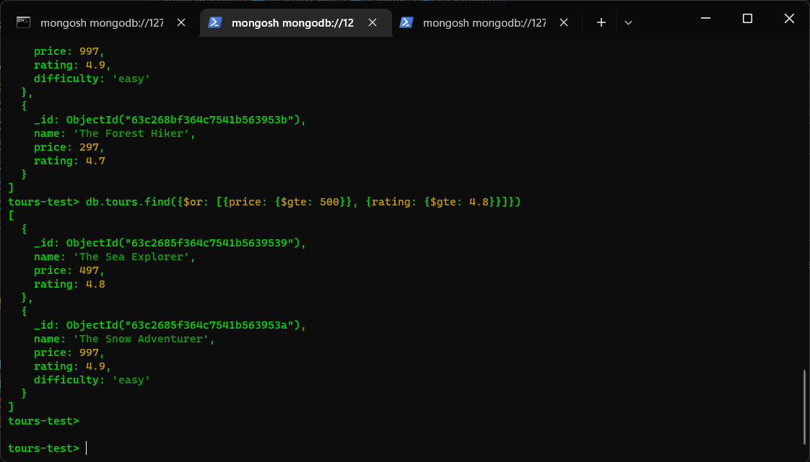
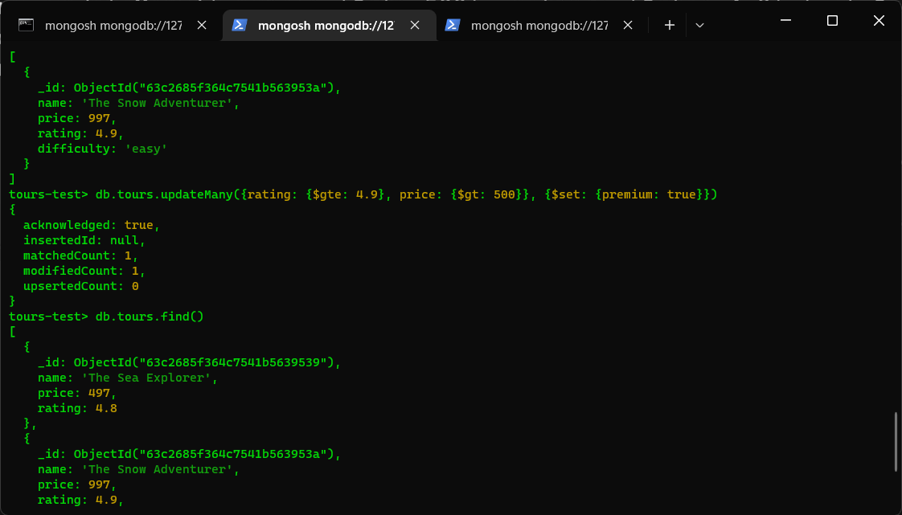

# Node

## Modules

### Files

#### Asynchronous

```js
const fs = require('fs');

// Readinng
const textRead = fs.readFileSync(
  './path/to/file/to/read.txt',
  'utf-8'
);

// Writing
const textWrite = `Some read info...`;
fs.writeFileSync('./path/to/file/to/write.txt', textWrite);
```

#### Synchronous Non-Blocking

```JS
fs.readFile('./path/to/file/to/read.txt', 'utf-8', (err, data1) => {
    // View data... If error, do sth.
}

// Callback is always optional
fs.writeFile('./path/to/file/to/write.txt', `${textWrite}`, 'utf8', (err /*No data*/) => {
    console.log('File written asyncly 😁');
});
```

### Http Server

#### Simple Web Server

```js
const http = require('http');

const server = http.createServer((req, res) => {
  res.end('Response from server!');
});

// * Callback is optional but shows listening has started successfully
server.listen(8000, '127.0.0.1', () => {
  console.log('Server listening started...');
});
```

#### Routing

```js
const server = http.createServer((req, res) => {
  const path = req.url;

  if (path === '/' || path === '/home') {
    res.end('Welcome home');
  } else if (path === '/exp') {
    res.end('Experience page');
  } else {
    // res.writeHead(404);
    // res.end('Page not found!');

    // ? You can include your own headers as status message
    res.writeHead(404, {
      'Content-type': 'text/html',
      'custom-header': 'some own header text',
    });
    res.end('<h3>Page not found pal!</h3>');
  }
});
```

### Events, Listeners & Emmiters

```js
const EventEmmiter = require('events');

class Project extends EventEmmiter {
  constructor() {
    super();
  }
}

const myEmmiter = new Project();

myEmmiter.on('newProject', () => {
  console.log('Start of a new project');
});

// Several liteners can be set on the same event
myEmmiter.on('newProject', (type) => {
  console.log(`The project is on ${type}`);
});

// Other arguments after emmiter are parameters to the listeners
myEmmiter.emit('newProject', 'Computer Science');
```

### Streams

Is an efficient way of data transmision in which info is read in chunks and sent to client without waiting for the entire read process to end, save it to a variable then respond. It clears the memory whenever a `readable stream` is complete and sends it back as `data` event.

```js
const fs = require('fs');
const server = require('http').createServer();

server.on('request', (req, res) => {
  const readable = fs.createReadStream('big-file.txt');

  readable.on('data', (chunk) => {
    res.write(chunk);
  });

  readable.on('end', () => {
    res.end();
  });

  readable.on('error', (err) => {
    console.log(err);
    res.statusCode = 500;
    res.end('File not found!');
  });
});

server.listen(8000, '127.0.0.1', () => {
  console.log('Listening...');
});
```

Thou this works, `Backpressure` can occur as the readable stream is much faster than the writable and therefore overwhelms it. The solution is using the `pipe()` where, `readableSource.pipe(writableDestination)`, where it regulates how fast the process happens. Eg for the above:

```js
const fs = require('fs');
const server = require('http').createServer();

server.on('request', (req, res) => {
  const readable = fs.createReadStream('test-file.txt');

  readable.pipe(res);
});

server.listen(8000, '127.0.0.1', () => {
  console.log('Listening...');
});
```

### Require under the hood

On requiring a module, it's wrapped in a `IEFE` as below which is seen in logging `require('module').wrapper`.

```js
[
  '(function (exports, require, module, __filename, __dirname) { ',
  '\n});',
];
```

Exports can be done individually or as a group.

#### Group

```js
class Calculator {
  add(a, b) {
    return a + b;
  }
  multiply(a, b) {
    return a * b;
  }
}

module.exports = Calculator;
```

Then imported and used as:

```js
const Calc = require('./Calculator');
const calc1 = new Calc();
calc1.add(1, 2);
```

#### Individual

```js
exports.subtract = (a, b) => a - b;
exports.divide = (a, b) => a / b;
```

```js
const { subtract, divide } = require('./02-multipleExports');
divide(9, 3);
```

## Express

Build on top of Node.

### Handling URL Parameters (CRUD)

#### 1. Create

```js
const express = require('express');
const fs = require('fs');

const app = express();

// Middleware
app.use(express.json());

const tours = JSON.parse(
  fs.readFileSync(`${__dirname}/dev-data/data/tours-simple.json`)
);

app.get('/api/v1/tours', (req, res) => {
  res.status(200).json({
    status: 'success',
    results: tours.length,
    data: { tours },
  });
});

app.post('/api/v1/tours', (req, res) => {
  const newId = tours[tours.length - 1].id + 1;
  const newTour = Object.assign({ id: newId }, req.body);

  tours.push(newTour);

  fs.writeFile(
    `${__dirname}/dev-data/data/tours-simple.json`,
    JSON.stringify(tours),
    (err) => {
      console.log(err);
    }
  );

  // 201 for creation
  res.status(201).json({
    status: 'success',
    data: {
      tour: newTour,
    },
  });
});

app.listen(3000, () => {
  console.log('App running on port 3000...');
});
```

##### Middleware

Middleware is a function can be used in `post` to modify incoming request data. It's created as:

```js
app.use(express.json());
```

#### 2. Read

```js
app.get('/api/v1/tours/:id', (req, res) => {
  const id = req.params.id * 1;

  const tour = tours.find((el) => el.id === id);

  if (!tour) {
    return res.status(404).json({
      status: 'fail',
      message: 'Invalid ID!',
    });
  }

  res.status(200).json({
    status: 'success',
    data: { tour },
  });
});
```

#### 3. Update

```js
app.patch('/api/v1/tours/:id', (req, res) => {
  // Search ID and update contents

  if (req.params.id * 1 >= tours.length) {
    return res.status(404).json({
      status: 'fail',
      message: 'Invalid ID!',
    });
  }

  res.status(200).json({
    status: 'success',
    data: {
      tour: '<Updated tour>',
    },
  });
});
```

#### 4. Delete

```js
app.delete('/api/v1/tours/:id', (req, res) => {
  // Search ID and update contents

  // 204 No Content
  res.status(204).json({
    status: 'success',
    data: null,
  });
});
```

### Code Refactoring

The above could be separated into functions and further combine related paths using `app.route`

```js
app.route('/api/v1/tours').get(getAllTours).post(createTour);

app
  .route('/api/v1/tours/:id')
  .get(getTour)
  .patch(updateTour)
  .delete(deleteTour);
```

### More on Middleware

They are like subfunctions in express. Almost everything is a middleware including the routing and data transfer that all make up the `request-response cycle`. Every middleware has access to a `next()` function which must be called unless it is a final middleware which sends data back `res.send`. If not called, the middlewares coming after it wont be run. If a `.send()` is called before other middlewares of the same or non-specified paths, then thats where middleware execution stops.
Middlewares without specific paths are run for every code execution.

```js
app.use((req, res, next) => {
  console.log('Middleware called 👋');
  next();
});
```

It can also me used to add properties to the request to use later, eg adding time like:

```js
app.use((req, res, next) => {
  req.timeRequested = new Date().toISOString();
  next();
});
```

### Router Mounting

Mounting an `express router` on another in order to distribute workload.

```js
const tourRouter = express.Router();

tourRouter.route('/').get(getAllTours).post(createTour);

tourRouter
  .route('/:id')
  .get(getTour)
  .patch(updateTour)
  .delete(deleteTour);

app.use('/api/v1/tours', tourRouter);
```

### Param Middleware

Middleware that runs only for a particular parameter specified in request url. Eg for `id` parameter:

```js
router.param('id', (req, res, next, val) => {
  console.log(`ID is ${val}`);
  next();
});
```

It has the 4th argument which holds the value of the param.
Can be used to validate the id for every router that needs it.

```js
exports.checkID = (req, res, next, val) => {
  console.log(`ID is ${val}`);

  if (req.params.id * 1 >= tours.length) {
    return res.status(404).json({
      status: 'fail',
      message: 'Invalid ID!',
    });
  }
```

### Chaining Multiple Middleware Functions

```js
router
  .route('/')
  .get(getAllTours)
  .post(tourControllers.checkBody, createTour);
```

The `tourControllers.checkBody` is an extra middleware checking if the `createTour` request body has all necessary parameters before it being created.

```js
exports.checkBody = (req, res, next) => {
  const tourBody = req.body;
  const { id, price } = tourBody;

  if (!id || !price) {
    return res.status(400).json({
      status: 'fail',
      message: 'Tour price and ID are required!!',
    });
  }
  next();
};
```

### Serving Static Files

Are files that can't be accessed from the url. `express.static` middleware is used to provide the dir with the static files which will then act as root. So to access any file inside the dir, go to localhost then the path to file without including the parent dir.

```js
app.use(express.static(`${__dirname}/public`));
```

To access: `127.0.0.1:<portNum>/fileName.txt, html...` if `fileName` is a file in `public` folder.

## Environment Variables

These are outside of `express` and are created by node. To view the env var by express:

```js
console.log(app.get('env')); // Returns 'environment
console.log(process.env);
```

Variables created by node can be seen through:

```js
console.log(process.env);
```

`env vars` are configured in the `config.env` file and injected in nodes env vars using `dotenv` package.

- In `config.env`

```js
NODE_ENV = development;
PORT = 3000;
```

- In `server.js` before requiring `app.js` in order to have access

```js
const dotenv = require('dotenv');
dotenv.config({ path: './config.env' });
```

Depending on set envs, different codes can be run at different places eg in the `package.json`s scripts, 2 npm starts can be set for either in `production` or `development`.

```js
"start:dev": "nodemon server.js",
"start:prod": "NODE_ENV=production nodemon server.js"
```

And back in `app.js`:

```js
if (process.env.NODE_ENV === 'development') {
  app.use(morgan('dev'));
}
```

## MongoDB

### Mongo Create

- Create db
  ```js
  use dbName
  ```
- Create collections within a `document`. The objects are input like in `JSON` but will be stored as `BSON`.
  ```js
  db.docName.insertMany({}, {});
  ```

### Mongo Read

- See all dbs or collections
  ```js
  show dbs
  db.docName.find()
  ```
- Search for specific collection
  ```js
  db.docName.find({property<SearchParam>: "value"})
  ```
- Query for specific range in collection
  ```js
  db.docName.find({ price: { $lte: 300 } }); // Will return all prices <=300
  ```
- And query
  ```js
  db.docName.find({ price: { $lte: 300 }, age: { $gt: 20 } });
  ```
- Or query
  ```js
  db.docName.find({
    $or: [{ price: { $lte: 300 } }, { age: { $gt: 20 } }],
  });
  ```
- Object projection - Selecting specific fields from the output. Eg to get only the names:

  ```js
  db.docName.find(
    { price: { $lte: 300 }, age: { $gt: 20 } },
    { name: 1 }
  );
  ```

  

### Mongo Updating

You can use `updateOne` or `updateMany` as needed, and use `$set` var for setting.

```js
db.docName.updateOne(
  { name: 'Some Namme' },
  { $set: { age: 'Age to set' } }
);
```



Replacing a collection is similar to update. Pass in the search criteria and its done.

```js
db.docName.replaceOne({<SearchQuery>}, {<NewData>});
```

### Mongo Deleting

Use `deleteOne` or `deleteMany` together with search query.

```js
db.docName.deleteOne({<SearchQuery>});
```

To delete all, search query is left empty:

```js
db.docName.deleteMany({});
```
